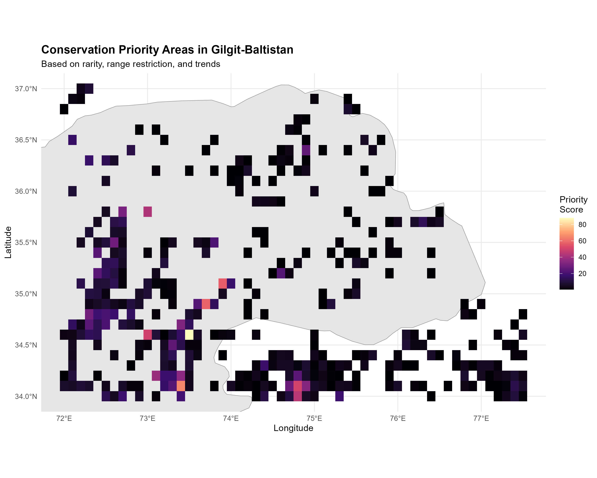
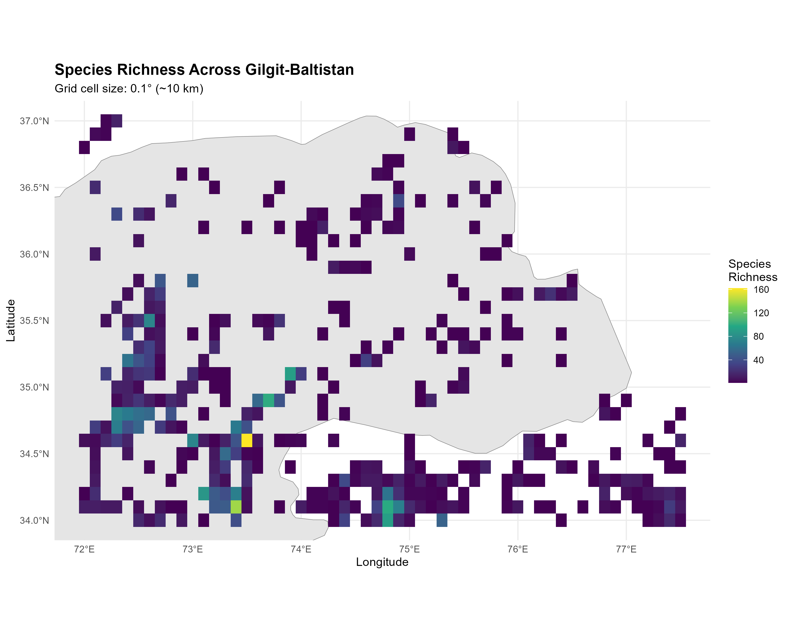
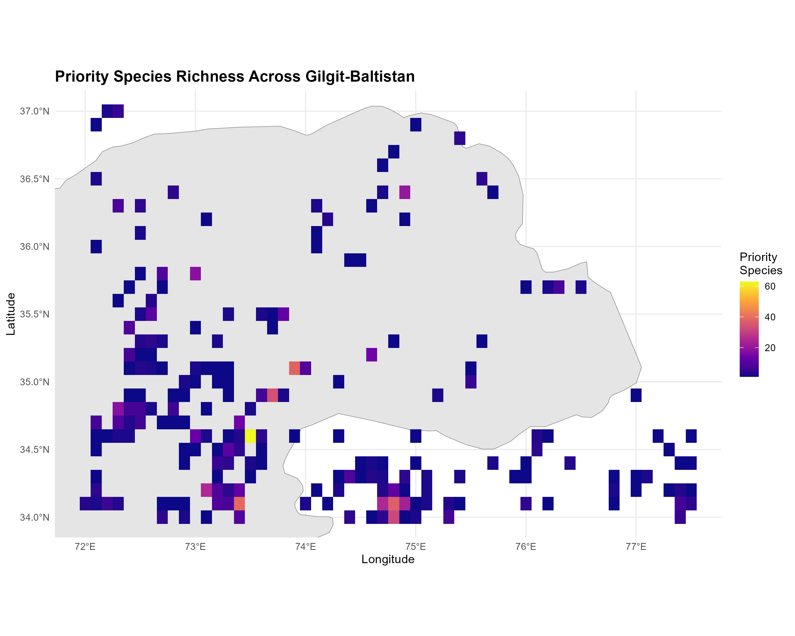

# Conservation Priority Assessment of Birds in Gilgit-Baltistan



**Author:** Syed Inzimam Ali Shah  
**Education:** BS Zoology (Virtual University of Pakistan), B.Sc. Forestry (Pakistan Forest Institute)  
**Contact:** inzimamsyed12@gmail.com  
**Date:** December 2025

---

## Project Overview

This project identifies bird species and geographic areas of conservation concern in Gilgit-Baltistan, Pakistan, using publicly available biodiversity data from GBIF and iNaturalist. The analysis employs rarity, range restriction, and temporal trends to prioritize species and locations for conservation action.

Gilgit-Baltistan is a biodiversity hotspot in the Western Himalayas, hosting diverse avifauna across extreme elevation gradients. This assessment provides data-driven priorities for conservation planning and monitoring in the region.

---

## Key Findings

### Species Diversity
- **441 unique bird species** documented across Gilgit-Baltistan
- **17,685 observations** from 1981-2025
- **370 species** identified as conservation priorities (84% of total)
- **162 species** classified as Critical Priority (very rare, <5 records)

### Conservation Priorities

**Critical Priority Species (162 species):**
- Very rare species with 1-5 observations
- Highly range-restricted (found in 1-2 locations)
- Examples: Tibetan Snowcock, Rosy Finch, Little Owl

**High Priority Species (208 species):**
- Uncommon species with 5-20 observations
- Limited geographic distribution
- Require targeted monitoring

**Priority Conservation Areas:**
- **5 high-priority grid cells** identified
- Top area: 73.5°E, 34.6°N (162 species, highest diversity)
- Priority areas concentrate in central and southern Gilgit-Baltistan

---

## Methodology

### Data Sources
1. **GBIF (Global Biodiversity Information Facility):** 14,765 records
2. **iNaturalist (Citizen Science Platform):** 2,920 records

### Analysis Framework

**Species Priority Scoring:**
- **Rarity Score (40%):** Based on total observation frequency
- **Range Restriction Score (30%):** Based on number of occupied grid cells
- **Temporal Trend Score (30%):** Based on observation changes over time

**Area Priority Scoring:**
- **Priority Species Richness (50%):** Number of high-priority species
- **Effort-Corrected Richness (30%):** Accounts for sampling bias
- **Total Species Richness (20%):** Overall diversity

### Workflow
1. Data download from GBIF and iNaturalist
2. Data cleaning and standardization
3. Exploratory spatial and temporal analysis
4. Multi-criteria conservation priority assessment
5. Visualization and reporting

---

## Repository Structure

```
gb-birds-conservation/
│
├── data/
│   ├── raw/                      # Original downloaded data
│   └── processed/                # Cleaned and analyzed data
│
├── scripts/
│   ├── 01_data_download.R        # Download from GBIF and iNaturalist
│   ├── 02_data_cleaning.R        # Data cleaning and standardization
│   ├── 03_exploratory_analysis.R # Exploratory visualizations
│   └── 04_conservation_priority_assessment.R  # Priority analysis
│
├── outputs/
│   ├── figures/                  # All maps and plots
│   └── tables/                   # Summary tables and lists
│
├── reports/
│   └── analysis_report.html      # Complete analysis report
│
├── README.md
└── LICENSE
```

---

## Key Visualizations

### 1. Temporal Patterns
- **Observation trends:** Sharp increase in records post-2020
- **Seasonal distribution:** Summer peak (June-August)
- **Monthly patterns:** Highest activity in May-July

### 2. Spatial Distribution

*Figure: Species richness patterns across Gilgit-Baltistan*

- **Species richness:** Concentrated in southern and central GB
- **Observation density:** Heavily clustered around Gilgit city
- **Priority areas:** Five critical conservation zones identified

### 3. Conservation Priorities

*Figure: Distribution of priority species across the region*

- **Priority species distribution:** Scattered across the region
- **Area priority scores:** Highest in well-surveyed, diverse locations
- **Priority species richness:** Up to 60+ priority species per area

---

## Results Summary

### Species Assessment
| Priority Level | Number of Species |
|---------------|-------------------|
| Critical Priority | 162 |
| High Priority | 208 |
| Medium Priority | 183 |
| Low Priority | 162 |

### Spatial Assessment
- **Total grid cells analyzed:** 574
- **Critical priority areas:** 1 grid cell
- **High priority areas:** 4 grid cells
- **Top priority location:** 73.5°E, 34.6°N (Gilgit region)

### Rare Species Highlights
- **Tibetan Snowcock** (*Tetraogallus tibetanus*): High-altitude specialist, 1 record
- **Rosy Finch** (*Carpodacus rubicilloides*): Montane species, 2 records  
- **Little Owl** (*Athene noctua*): Nocturnal raptor, extremely rare
- **Red-necked Phalarope** (*Phalaropus lobatus*): Migratory wader, 2 records

---

## Technologies Used

### R Packages
- **Data Manipulation:** `tidyverse`, `dplyr`, `tidyr`
- **Biodiversity Data:** `rgbif`, `rinat`
- **Spatial Analysis:** `sf`, `raster`, `rnaturalearth`
- **Visualization:** `ggplot2`, `viridis`, `tmap`

### Tools
- **R (version 4.5.1):** Statistical computing and graphics
- **RStudio:** Integrated development environment
- **Git/GitHub:** Version control and collaboration

---

## Conservation Recommendations

### Immediate Actions
1. **Verify rare species records:** Ground-truth the 162 critical priority species
2. **Expand survey coverage:** Focus on under-surveyed northern regions
3. **Monitor high-altitude species:** Track climate change impacts on montane birds
4. **Protect priority areas:** Advocate for conservation status of identified hotspots

### Long-term Monitoring
1. **Establish baseline data:** Systematic surveys in priority grid cells
2. **Citizen science engagement:** Leverage iNaturalist for ongoing monitoring
3. **Seasonal surveys:** Capture migratory and breeding season diversity
4. **Trend analysis:** Annual assessments to detect population changes

### Research Gaps
1. **Northern Gilgit-Baltistan:** Minimal data coverage
2. **High-altitude zones:** Limited winter observations
3. **Nocturnal species:** Under-represented in citizen science data
4. **Breeding ecology:** Nesting and reproductive data lacking

---

## Limitations

1. **Sampling Bias:** Heavy concentration of observations around Gilgit city
2. **Temporal Gaps:** Limited data before 2015; most records from 2020-2025
3. **Species Identification:** Some records lack full taxonomic verification
4. **Geographic Coverage:** Under-surveyed remote and high-altitude areas
5. **Detection Probability:** Rare and cryptic species likely under-detected

---

## How to Use This Repository

### Prerequisites
- R (version 4.0 or higher)
- RStudio (recommended)
- Required R packages (see scripts for installation)

### Running the Analysis

1. **Clone the repository:**
```bash
git clone https://github.com/Syedinzimam/gb-birds-conservation.git
cd gb-birds-conservation
```

2. **Set working directory in R:**
```r
setwd("C:/gb-birds-conservation")
```

3. **Run scripts in order:**
```r
source("scripts/01_data_download.R")
source("scripts/02_data_cleaning.R")
source("scripts/03_exploratory_analysis.R")
source("scripts/04_conservation_priority_assessment.R")
```

4. **View outputs:**
- Figures: `outputs/figures/`
- Tables: `outputs/tables/`
- Processed data: `data/processed/`

---

## Data Availability

### Raw Data
- GBIF download: `data/raw/gbif_raw.csv`
- iNaturalist download: `data/raw/inat_raw.csv`

### Processed Data
- Combined cleaned dataset: `data/processed/birds_combined.csv`
- Species list: `data/processed/species_list.csv`

### Analysis Report
- Complete HTML report: `reports/analysis_report.html` (open in browser)

### Priority Assessments
- Species priorities: `outputs/tables/species_conservation_priorities.csv`
- Area priorities: `outputs/tables/area_conservation_priorities.csv`
- High-priority species list: `outputs/tables/high_priority_species.csv`

---

## Citation

If you use this analysis or data in your work, please cite:

```
Shah, S.I.A. (2025). Conservation Priority Assessment of Birds in Gilgit-Baltistan. 
GitHub repository: https://github.com/Syedinzimam/gb-birds-conservation
```

---

## Acknowledgments

- **GBIF:** For providing open-access biodiversity data
- **iNaturalist:** For citizen science observations and community verification
- **Birds of Gilgit-Baltistan:** For regional bird documentation and awareness
- **Forest, Parks and Wildlife Department, Gilgit-Baltistan:** For conservation efforts

---

## Related Projects

1. [Pakistan Biodiversity Analysis](https://github.com/Syedinzimam/pakistan-biodiversity-analysis)
2. [Species Distribution Modeling: Himalayan Ibex](https://github.com/Syedinzimam/SDM_Himalayan_Ibex)
3. [Booni Butterfly Diversity](https://github.com/Syedinzimam/booni-butterfly-diversity)

---

## Future Work

1. **Integration with eBird data:** Expand temporal and geographic coverage
2. **Species Distribution Modeling:** Predict suitable habitats for priority species
3. **Climate change vulnerability:** Assess threats to high-altitude species
4. **Protected area gap analysis:** Compare priorities with existing conservation areas
5. **Community-based monitoring:** Develop protocols for local participation

---

## License

This project is licensed under the MIT License - see the LICENSE file for details.

---

## Contact

**Syed Inzimam Ali Shah**  
Email: inzimamsyed12@gmail.com  
GitHub: [@Syedinzimam](https://github.com/Syedinzimam)

For questions, collaborations, or data requests, please open an issue or contact directly.

---

## Project Status

 **Completed:** December 2025

**Current Version:** 1.0  
**Last Updated:** December 2025

---

*This project contributes to bird conservation efforts in the Western Himalayas by providing data-driven priorities for monitoring and protection of Gilgit-Baltistan's avifauna.*